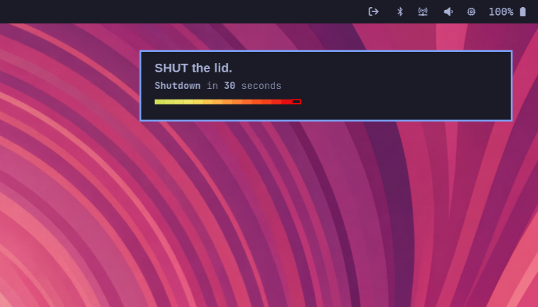

# just-go-home

A waybar widget for Hyprland (and any modern Wayland/waybar setup — built
and tested on [Omarchy](https://omarchy.org)) that ends the workday for me,
because I won't.

The widget escalates top-to-bottom: calm → warm → warning → urgent →
flashing → shutdown. Notifications follow the same arc:

### Waybar Widget (escalation)


### Mako Notifications

|  |  |  |
|---|---|---|

Regenerate (Hyprland + grim + slurp): `screenshots/capture.sh` for the bar,
`screenshots/capture-notifications.sh` for the mako variants.

## Why

Work expands. Family time doesn't. Without a forcing function, the day bleeds
into the evening and the evening bleeds into nothing. `just-go-home` is the
forcing function.

It is a ritual with teeth. The ritual is the countdown — the visible march
toward the cutoff, the escalating colors and notifications. The teeth are the
shutdown.

It defends the other side of the cutoff: personal life, family, the hours
that don't belong to work and never did. The widget exists so those hours
stop getting borrowed.

### Principles

- **Always visible.** The ETA lives in the bar. Discipline is built from
  constant awareness, not from alarms.
- **Escalation by color.** Calm when the cutoff is far. Warmer as it
  approaches. Last minutes: flashing white and vivid red. The bar should make
  me uncomfortable on purpose.
- **Notifications that lean in.** `[60m, 30m, 15m, 5m, 1m, 30s]` and a final
  `TIME IS UP!` at zero. The cadence tightens; by the last minute the system
  is shouting.
- **Then it shuts down.** Not a lock. Not a sleep. A shutdown. The work
  session ends because the machine ends.
- **Configurable pattern, not a single time.** Weekdays at 17:00 today.
  Something else next quarter. The schedule is mine; the enforcement is not.

### The escape hatch

There is one. I am not a fanatic. To postpone, I type — in sequence — a
rotating phrase about the good things waiting for me if I leave on time. The
override is not a password; it is a reminder. By the time I finish typing it,
I usually don't want the override.

### What it is not

- Not a productivity tool. It doesn't care what I got done.
- Not a focus timer. It doesn't protect the work; it ends it.
- Not gentle. Gentle didn't work.
- Not for anyone else. This is calibrated for one person on one laptop.

If the widget is on screen, the day has an end. If the day has an end, the
evening is mine. That is the whole point.

## Requirements

- Linux + Wayland
- Python ≥ 3.11 (uses `tomllib`)
- [waybar](https://github.com/Alexays/Waybar) — for the status bar widget
- [mako](https://github.com/emersion/mako) (or any `notify-send`-compatible
  daemon supporting `synchronous` hints — replaces previous notification)
- `systemd` — `systemctl poweroff` is the shutdown mechanism
- For the click-to-postpone flow: a terminal reachable via
  `xdg-terminal-exec` and `uwsm-app` (Hyprland-with-uwsm setups, including
  Omarchy, get this for free). Adjust the `on-click` line in your waybar
  config if your setup differs — any terminal that runs
  `just-go-home postpone` works.

## Install

```sh
./install.sh
just-go-home init
```

`init` writes `~/.config/just-go-home/config.toml` and prints waybar/style
snippets. Add the `custom/just-go-home` module to your waybar `config.jsonc`
and the styles to `style.css`, then restart waybar.

## Config

`~/.config/just-go-home/config.toml`:

```toml
postpone_minutes = 15

phrases = [
  "my children will not be small forever",
  "my wife deserves the best of me, not the rest",
  "the work will still be here tomorrow",
]

[[targets]]
days = ["mon", "tue", "wed", "thu", "fri"]
time = "17:00"
```

Optional: `notification_messages` (calm pool, eta > 60s) and
`urgent_notification_messages` (eta ≤ 60s).

## Behavior

- Widget: streaming JSON via `just-go-home tick --loop`.
- Color escalates calm → warm → warning → urgent → flashing → shutdown.
- Notifications fire at offsets `[60m, 30m, 15m, 5m, 1m, 30s]` plus a final
  `TIME IS UP!` at eta 0. Each replaces the previous in mako.
- 10s grace after the final notification before `systemctl poweroff`.
- Click the widget → floating terminal runs `just-go-home postpone`.

## Postpone

Click the widget. The terminal asks you to type a randomly-chosen phrase
from the config. Words are revealed one at a time as you finish the previous
one. Wrong key → bell + red flash. Pastes are detected (rapid input) and
rejected. ESC cancels. Successful entry shifts the target by
`postpone_minutes`.

## Commands

```text
just-go-home tick [--loop]   # waybar JSON (one-shot or streaming)
just-go-home postpone        # interactive override
just-go-home status          # current target + eta
just-go-home init            # write example config + print snippets
```

## Env

- `JGH_DRY_RUN=1` — prints "would run systemctl poweroff" instead of actually
  powering off (for testing).
